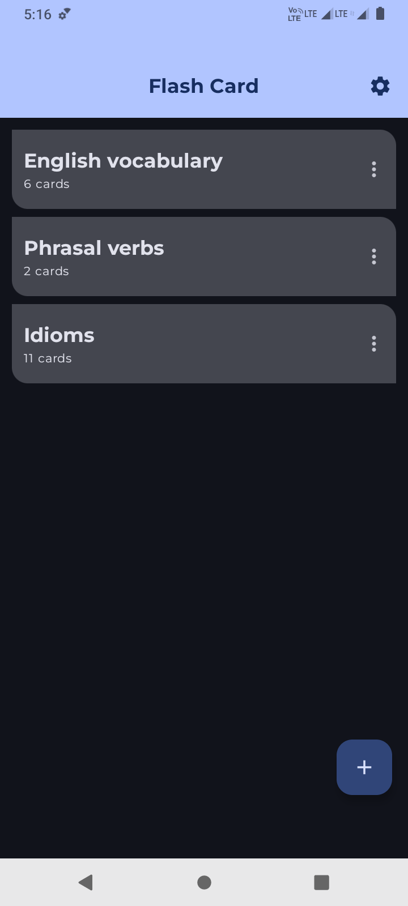
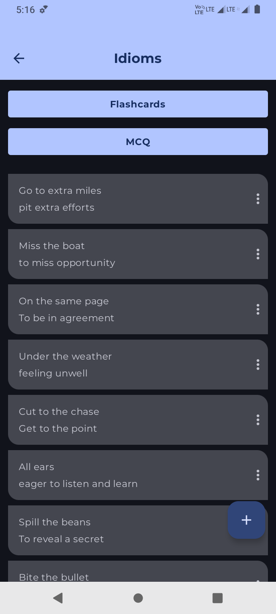
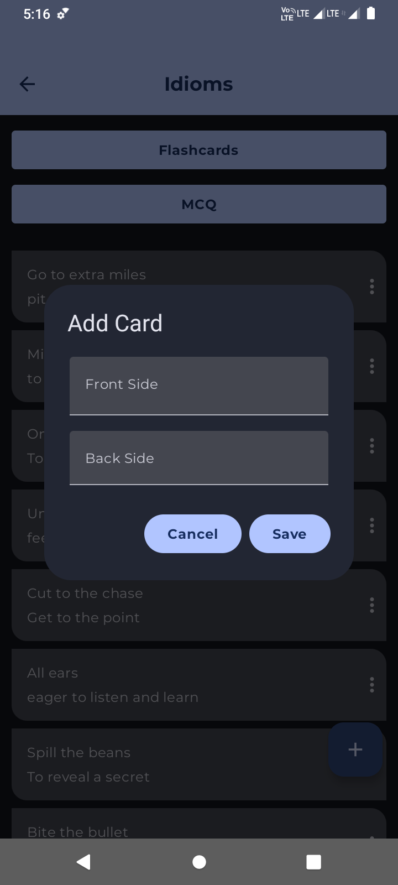
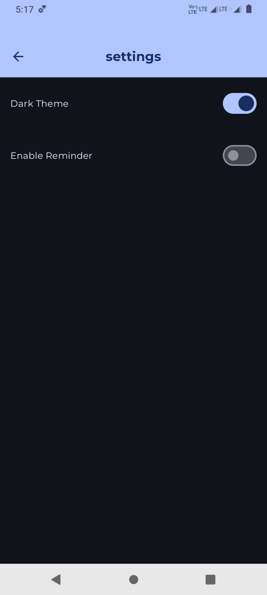
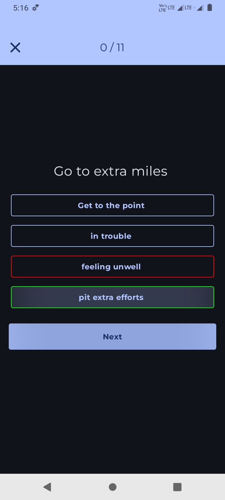
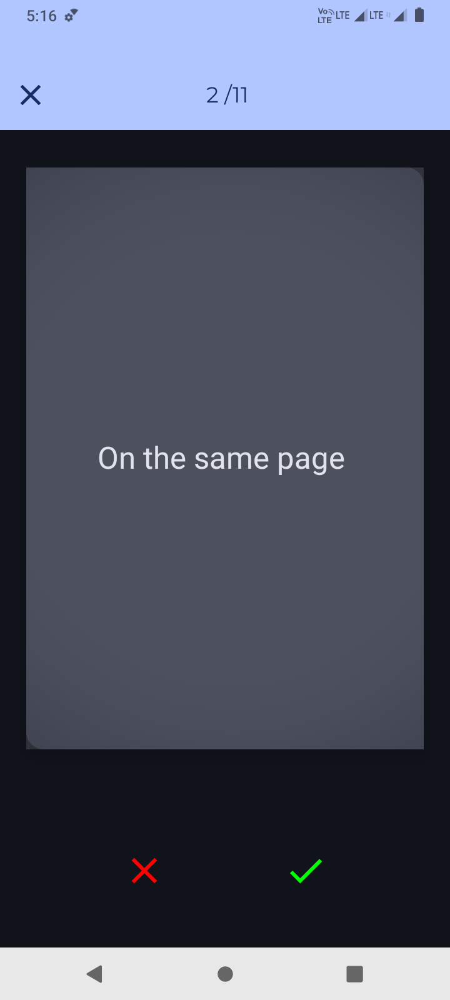
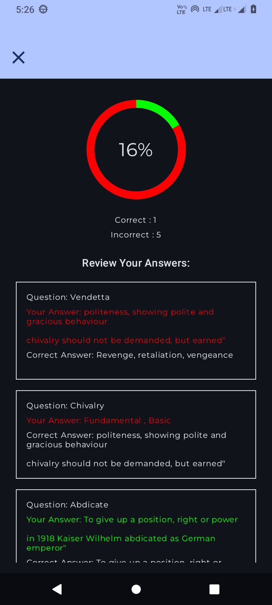

# Flashcard App

Welcome to the Flashcard App! This app allows users to create and manage flashcards to help with studying and memorization.

## Features

- Create and manage flashcards.
- Organize flashcards by categories.
- Toggle between light and dark themes.
- Set daily reminders for studying.

## Screenshots

<table>
  <tr>
    <td></td>
    <td></td>
    <td></td>
  </tr>
  <tr>
    <td>Home Screen</td>
    <td>Card Details Screen</td>
    <td>Add Card Screen</td>
  </tr>
  <tr>
    <td></td>
    <td></td>
    <td></td>
  </tr>
  <tr>
    <td>Settings Screen</td>
    <td>Quiz Screen</td>
    <td>Flip Card Screen</td>
  </tr>
  <tr>
    <td></td>
  </tr>
  <tr>
    <td>Result Screen</td>
  </tr>
</table>

## Installation

### Prerequisites

- Android Studio
- An Android device or emulator
